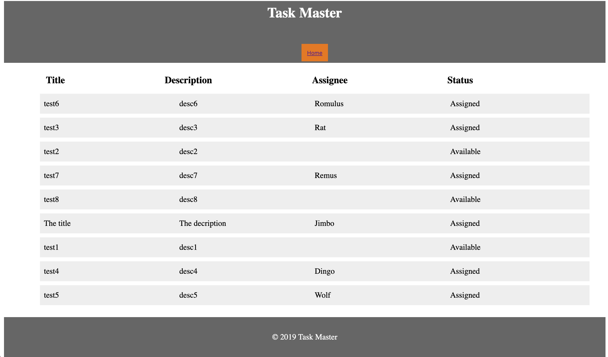

# Task Master

Task tracking application that allow users to keep track of tasks to be completed and their status. It diplays all tasks in the database.

This project was bootstrapped with [Create React App](https://github.com/facebook/create-react-app).
***

## Available Scripts

In the project directory, you can run:

### `npm start`

Runs the app in the development mode. 
Open [http://localhost:3000](http://localhost:3000) to view it in the browser.

### `npm run build`

Builds the app for production to the `build` folder. 
Your app is ready to be deployed!
***

**Home Page:**

***

**Deployed App:**

http://t1tm.s3-website-us-west-2.amazonaws.com
***

**Back-end repo:**

https://github.com/esa2/taskmaster
***
